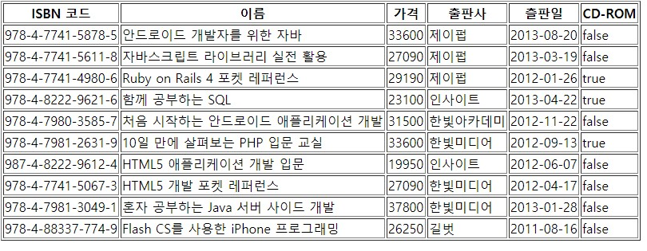

# 컨트롤러

## 컨트롤러 클래스 생성
```shell
> rails new generate controller 컨트롤러이름 [동작 옵션]
```

## 컨트롤러 클래스 삭제
```shell
> rails destroy 명령어
```

## 컨트롤러 클래스 기본
```ruby
class HelloController < ApplicationController
    def index
        render plain: 'Hello World!'
    end
end
```
책에서는 render text: 로 되어있는데, 왜인지 Template is missing 에러가 났고,
구글링을 해보니까 plain으로 수정하면 되는 듯 하다. 

## 모델에서 데이터 추출해오는 컨트롤러
> model.md 데이터베이스 클라이언트 실행 부분까지 보고 오기

1) 모델에서 데이터 목록 관련 action 추가하기
> /controllers/hello_controller.rb
```ruby
class HelloController < ApplicationController
    def index
        render plain: 'Hello World!'
    end

    def list
        @books = Book.all
    end
end

```

2) 템플릿 작성
> /views/hello/list.html/erb
```erb
<table border = "1">
    <tr>
        <th>ISBN 코드</th>
        <th>이름</th>
        <th>가격</th>
        <th>출판사</th>
        <th>츨판일</th>
        <th>CD-ROM</th>
    </tr>
    <% @books.each do |book| %>
        <tr>
            <td><%= book.isbn %></td>
            <td><%= book.title %></td>
            <td><%= book.price %></td>
            <td><%= book.publish %></td>
            <td><%= book.published %></td>
            <td><%= book.cd %></td>
            </td>
        </tr>
    <% end %>
</table>
```

3) 결과




